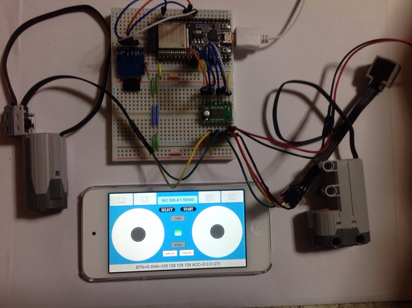
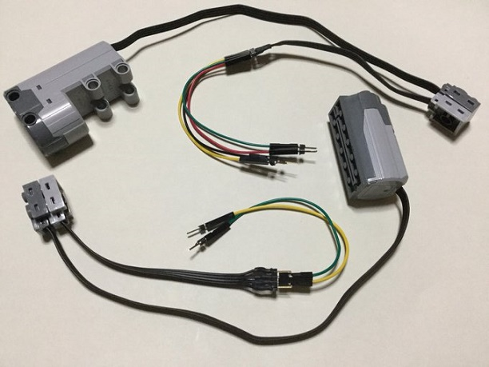
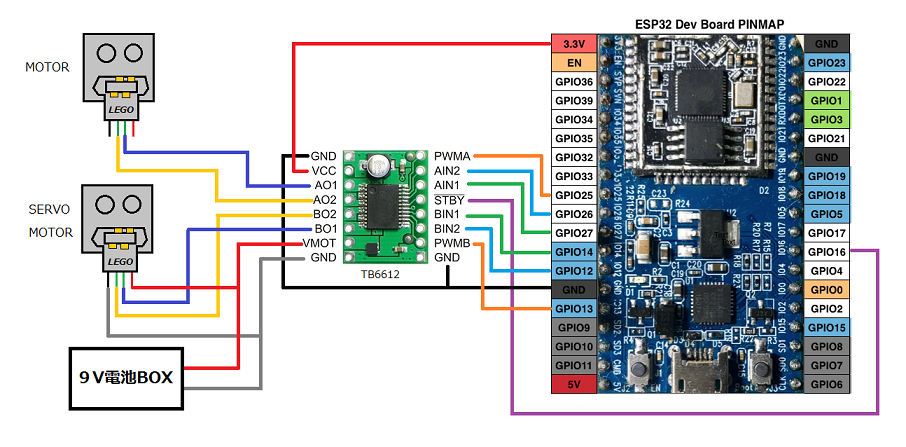
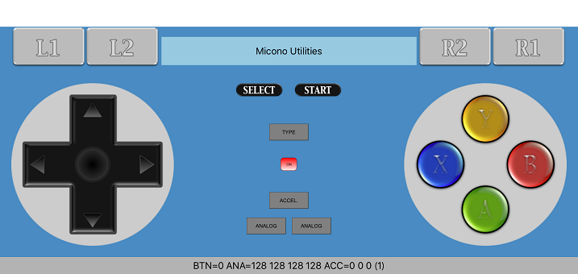
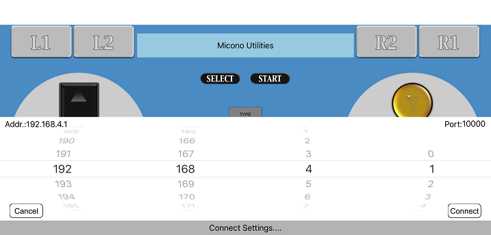
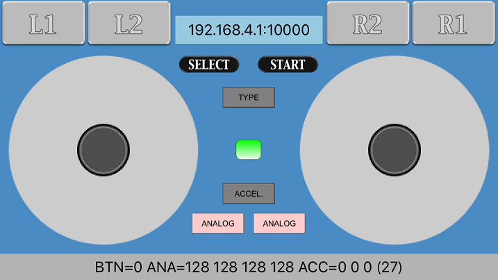

# ESP32_LegoMotor_RCWC
ESP32 + TB6612モータードライバー + RCWController で、LEGO Power Functions Motor と Servo Motor を制御します。  
  
### 必要な物 ###
* ESP32-DevKitC 
* TB6612モータードライバーモジュール
* LEGO Power Functions Motor と Servo Motor と 延長ケーブル
* [RCWController](http://rcwcontroller.micutil.com "Title") (ここからダウンロードして下さい。)
* Arduino IDE (1.8.0で動作確認をしました。) 
* [Arduino core for ESP32 WiFi chip](https://github.com/espressif/arduino-esp32 "Title")
* iPhone/iPad/iPod Touch

私は、iPod Touchで動作確認をしました。

### 変換コネクタ作成 ###
ここを参考に延長ケーブルを切って変換コネクターを作成します。 
[Take Control Over Lego Power Functions](https://create.arduino.cc/projecthub/Notthemarsian/take-control-over-lego-power-functions-ee0bfa "Title")   
  

### 配線 ###
  

### 使い方 ###
 1. iPhone/iPad/iPod TouchにRCWControllerをインストールして下さい。
 2. ESP32にスケッチを書き込み後、シリアルモニタを開くとIPアドレスとポート番号が表示されるのでメモしておいて下さい。
 3. ESP32の電源を入れた状態でiPhone/iPad/iPod Touchの設定を開きWiFiを選択すると、ESP32というアクセスポイントが表示されるので接続します。
パスワードは　esp32pass　です。 
 4. RCWControllerを起動して、真ん中の赤いONボタン押します。 
  
 5. IPアドレスの設定が出るので先ほどメモしたIPアドレスとポート番号を指定してConnectボタンを押します。 
  
 6. 上手く接続できれば左右のアナログスティックでモーターとサーボモーターを制御できるようになります。  
  

  

---
RCWController since 2016-02-17 / Copyright Micono Utilities. All Rights Reserved
 
